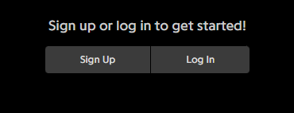
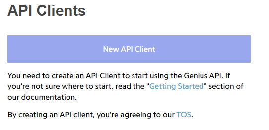
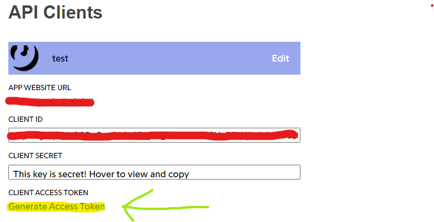

# 🎶 Discord Music Bot

Welcome to the Discord Music Bot repository! This bot is a powerful, feature-rich music bot built with Python and `discord.py`, offering seamless integration with YouTube and Spotify. This project was created with the assistance of ChatGPT to demonstrate the capabilities of AI-driven development.

## Table of Contents

1. [Features](#features)
2. [Commands](#commands)
3. [Installation](#installation)
   - [Option 1: Clone the repository](#option-1-clone-the-repository)
   - [Option 2: Use the setup installer](#option-2-use-the-setup-installer)
4. [Getting Spotify Credentials](#getting-spotify-credentials)
5. [Getting Genius API Key](#getting-genius-api-key)
6. [Discord Bot Permissions](#discord-bot-permissions)
   - [Required Permissions](#required-permissions)
7. [Contributing](#contributing)
8. [License](#license)
9. [Acknowledgements](#acknowledgements)
10. [Planned Features](#planned-features)

## Features

- **YouTube Playback**: Play your favorite tracks directly from YouTube.
- **Spotify Integration**: Add songs from Spotify and enjoy high-quality music.
- **Queue Management**: Add, skip, pause, resume, and stop songs with ease.
- **Looping**: Loop the current song indefinitely.
- **Volume Control**: Adjust the playback volume to your preference.
- **Interactive Slash Commands**: Utilize modern slash commands for an enhanced user experience.
- **Lyrics Fetching**: Fetch lyrics for the currently playing song using the Genius API.
- **Voting System**: Users can vote to skip the current song.
- **Inactivity Auto-Disconnect**: The bot disconnects after a period of inactivity to save resources.
- **Custom Playlists**: Create and play custom playlists.
- **Playback Controls with Buttons**: Control playback using interactive buttons.
- **Multi-Language Support**: Get help and feedback in multiple languages.

## Commands

| Command                            | Description                                             |
|------------------------------------|---------------------------------------------------------|
| `/join`                            | Join your voice channel.                                |
| `/leave`                           | Leave the voice channel.                                |
| `/play <URL>`                      | Play a YouTube or Spotify track.                        |
| `/pause`                           | Pause the playback.                                     |
| `/resume`                          | Resume the playback.                                    |
| `/skip`                            | Skip the current song.                                  |
| `/stop`                            | Stop the playback and clear the queue.                  |
| `/lyrics`                          | Fetch the lyrics for the current song.                  |
| `/help`                            | Show help information.                                  |
| `/volume <percent>`                | Set the playback volume (0-100%).                       |
| `/loop <on/off>`                   | Enable or disable looping of the current song.          |
| `/add_to_playlist <name> <url>`    | Add a song to a custom playlist.                        |
| `/play_playlist <name>`            | Play songs from a custom playlist.                      |
| `/vote_skip`                       | Vote to skip the current song.                          |
| `/clear <number>`                  | Clear a number of messages in a channel (admin only).   |
| `/list_playlists`                  | List all custom playlists and their creators.           |

## Installation

You have two options to set up the Discord Music Bot: cloning the repository or using the provided setup installer.

### Option 1: Clone the repository

1. **Clone the repository:**

    ```sh
    git clone https://github.com/MCbabel/discord-music-bot.git
    cd discord-music-bot
    ```

2. **Install the required dependencies:**

    ```sh
    pip install -r requirements.txt
    ```

3. **Set up your environment variables:**

    Create a `.env` file in the root directory and add your Discord token, Spotify credentials, and Genius API key:

    ```env
    DISCORD_TOKEN=your_discord_token
    SPOTIFY_CLIENT_ID=your_spotify_client_id
    SPOTIFY_CLIENT_SECRET=your_spotify_client_secret
    GENIUS_ACCESS_TOKEN=your_genius_api_key
    ```

4. **Run the bot:**

    ```sh
    python bot.py
    ```

### Option 2: Use the setup installer

1. **Download the setup file:**

   - [Download setup.bat](https://github.com/MCbabel/discord-music-bot/releases/download/v1.4.0/setup.bat)

2. **Run the setup file:**

   Double-click on the `setup.bat` file and follow the prompts to enter your Discord Bot Token, Spotify Client ID, Spotify Client Secret, and Genius API Key. This will automatically set up your environment variables and install the required dependencies.

3. **Run the bot:**

   Once the setup is complete, simply run the `bot.py` file to start the bot.

   ```sh
   python bot.py
   ```

## Getting Spotify Credentials

To integrate Spotify, you need to obtain a Client ID and Client Secret from the Spotify Developer Dashboard. Here are the steps:

1. **Create a Spotify Developer Account:**
   - Go to the [Spotify Developer Dashboard](https://developer.spotify.com/dashboard/login).
   - Log in with your Spotify account or create a new account.

2. **Create an App:**
   - Click on "Create an App".
   - Fill in the required details like App name and description.
   - Agree to the terms and conditions and click "Create".

3. **Retrieve Your Credentials:**
   - Once your app is created, you will be redirected to the app dashboard.
   - Here, you can find your **Client ID** and **Client Secret**. Copy these values.

4. **Add Credentials to .env File:**
   - Update your `.env` file with the obtained credentials.

    ```env
    DISCORD_TOKEN=your_discord_token
    SPOTIFY_CLIENT_ID=your_spotify_client_id
    SPOTIFY_CLIENT_SECRET=your_spotify_client_secret
    GENIUS_ACCESS_TOKEN=your_genius_api_key
    ```

## Getting Genius API Key

To fetch lyrics, you need to obtain a Genius API Key. Here are the steps:

1. **Create a Genius Account:**
   - Go to the [Genius API Clients](https://genius.com/api-clients) page.
   - Log in with your Genius account or create a new account.

   

2. **Create an API Client:**
   - Click on "Create an API Client".
   - Fill in the required details like App name and description.
   - Agree to the terms and conditions and click "Save".

   

3. **Retrieve Your API Key:**
   - Once your app is created, you will be redirected to the app dashboard.
   - Here, you can find your **Client Access Token**. Copy this value.

   

4. **Add API Key to .env File:**
   - Update your `.env` file with the obtained API Key.

    ```env
    DISCORD_TOKEN=your_discord_token
    SPOTIFY_CLIENT_ID=your_spotify_client_id
    SPOTIFY_CLIENT_SECRET=your_spotify_client_secret
    GENIUS_ACCESS_TOKEN=your_genius_api_key
    ```

## Discord Bot Permissions

To ensure that your bot works correctly, you need to invite it to your server with the necessary permissions. Use the following OAuth2 URL to generate an invite link for your bot:

```
https://discord.com/oauth2/authorize?client_id=YOUR_CLIENT_ID&permissions=277083450752&scope=bot%20applications.commands
```

Replace `YOUR_CLIENT_ID` with your bot's client ID, which you can find in the [Discord Developer Portal](https://discord.com/developers/applications).

### Required Permissions

- `View Channels`: Allows the bot to see text channels and read messages.
- `Send Messages`: Allows the bot to send messages in text channels.
- `Connect`: Allows the bot to connect to voice channels.
- `Speak`: Allows the bot to play audio in voice channels.
- `Use Slash Commands`: Allows the bot to register and use slash commands.
- `Manage Messages`: Required for the `/clear` command to delete messages.
- `Embed Links`: Allows the bot to send embedded rich content.
- `Read Message History`: Allows the bot to read message history (useful for commands like `/lyrics`).

## Contributing

Contributions are welcome! Please fork this repository and submit a pull request for any changes you would like to make.

## License

This project is licensed under the MIT License. See the [LICENSE](LICENSE) file for details.

## Acknowledgements

This project was created with the assistance of [ChatGPT](https://www.openai.com/chatgpt), demonstrating the power of AI in software development. Special thanks to the OpenAI team for providing such an incredible tool.

## Planned Features

- [x] Lyrics fetching using Genius API
- [x] Music playback controls via buttons
- [x] Custom playlists
- [x] Voting to skip songs
- [x] Auto-disconnect after inactivity
- [x] Volume control
- [ ] Now playing message with song progress
- [ ] Integration with more streaming services
- [x] User-specific playlists
- [ ] Song search functionality
- [ ] Customizable bot settings

---

Happy listening! 🎵
